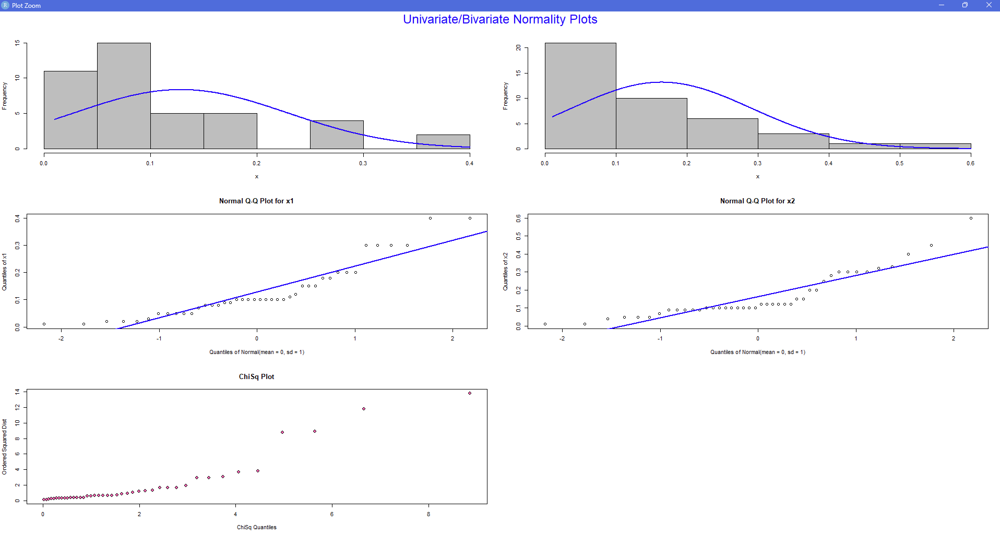

```{r, include = FALSE}
knitr::opts_chunk$set(
  collapse = TRUE,
  comment = "#>",
  warning = FALSE,
  message = FALSE,
  fig.align = "center",
  fig.height = 5,
  fig.width = 6
)
```

```{r setup}
library(ROSAMATH5793proj2)
```

# Introduction

This package is for MATH5793 Project 2. It consists of four functions and a shiny app. The example of the functions follow examples from the text. The descriptions for each individual function are below. All of the data included in this package was pre-processed and loaded in to include variable names, etc.

# The `myBivarNorm()` Function

This function takes a bivariate data frame as input, and checks for normality using Q-Q Plots and Histograms for univariate tests, and Chi-Square Plots for the bivariate tests. This function follows Example 4.10 of the text.

```{r}
myBivarNorm(df = micro, alpha = 0.05, contour = 0.5)
```



As we can see from the plot above, both variables do not appear to come from a Normal distribution. Thus, a power transformation using `boxcox()` would be in order for this data. Running this analysis is (not) beyond the scope of this package, but for brevity, the results suggest raising both vectors the $\frac{1}{4}$ (4th root) will be the power transformation for both variables. We will use this information in the next example.

# The `myTSQint()` Function

This example flows directly from the previous function. This function provides a simultaneous confidence interval for the bivariate data. Also, a plot of the contour ellipse is provided. This function follows Examples 5.3 and 5.4 from the text.

First, to prepare the data:

```{r}
microR <- micro^(0.25)
myTSQint(df = microR, alpha = 0.05)
```

Thus the simultaneous $95\%$ confidence interval for the Microwave data is provided by

$$
\begin{align}
  (0.5167, 0.6118) && \text{and} && (0.5551, 0.6509)
\end{align}
$$

for `Closed` and `Open`, respectively. 

# The `myFPC()` Function

This function performs factor analysis on a data frame. It produces two outputs from the Principal Component method and from the Maximum Likelihood method. This function follows Example 9.8 of the text.

```{r}
R <- as.matrix(OLYMPIC)
ROSAMATH5793proj2::myFPC(sigma = R, m = 4)
```

# The `myClusterF()` Function

This function performs cluster analysis on a given data frame. It returns dendrograms for Single, Complete, and Average linkages. This function follows Examples 12.4, 12.6, and 12.8 of the text.

```{r}
myClusterF(df = LANGUAGE)
```

The Shiny App - `shinyfactors`

The shiny app produces a table of Principal Component solutions for factor models with a specified number of factors $m$. 

To view this app, run the following code in an active `R` session:

`shiny::runGitHub(repo = "ROSAMATH5793proj2", username = "brandanrosa", subdir = "inst/shinyfactors")`

or, the app may be called with this package loaded with the function `shinyfactors`.
